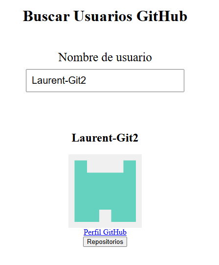
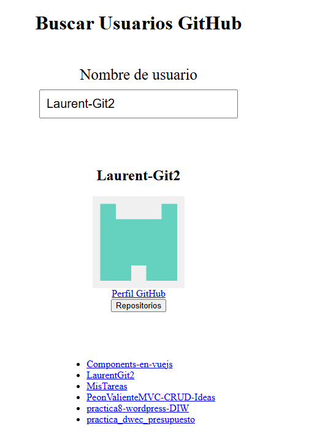

# GitHub Viewer · Vue 3

Aplicación frontend desarrollada durante mi formación en DAW para buscar usuarios de GitHub y consultar sus repositorios públicos mediante la API de GitHub.

## Funcionalidades

- Búsqueda de usuarios al pulsar Enter.
- Visualización del nombre de usuario y su avatar.
- Enlace al perfil de GitHub.
- Consulta de repositorios mediante el botón «Repositorios».
- Enlaces a los repositorios mostrados.
- Mensaje de error cuando la consulta del usuario no devuelve una respuesta válida.

## Tecnologías

Vue 3 · JavaScript · API REST · Fetch · Vite · HTML5 · CSS3

## Aprendizaje

Práctica de componentes con Vue y Options API, datos reactivos,
v-model, eventos, renderizado condicional con v-if y listas con v-for.

Incluye peticiones asíncronas mediante fetch y async/await.

## Capturas

### Búsqueda y perfil


### Repositorios públicos


## Ejecución local

Con Node.js y npm instalados, abrir un terminal en la carpeta
que contiene package.json y ejecutar:

```bash
npm install
npm run dev
```

Abrir la dirección local indicada en el terminal.

## Próximas mejoras

- Mejorar el diseño y la adaptación a móviles.
- Gestionar los errores de conexión y de consulta de repositorios.
- Añadir un indicador visual de carga.
- Incorporar paginación para consultar más repositorios.

## Autor

Laurent Sontag  
Estudiante de DAW · IES Mare Nostrum

[Perfil de GitHub](https://github.com/Laurent-Git2)


# .

This template should help get you started developing with Vue 3 in Vite.

## Recommended IDE Setup

[VS Code](https://code.visualstudio.com/) + [Vue (Official)](https://marketplace.visualstudio.com/items?itemName=Vue.volar) (and disable Vetur).

## Recommended Browser Setup

- Chromium-based browsers (Chrome, Edge, Brave, etc.):
  - [Vue.js devtools](https://chromewebstore.google.com/detail/vuejs-devtools/nhdogjmejiglipccpnnnanhbledajbpd)
  - [Turn on Custom Object Formatter in Chrome DevTools](http://bit.ly/object-formatters)
- Firefox:
  - [Vue.js devtools](https://addons.mozilla.org/en-US/firefox/addon/vue-js-devtools/)
  - [Turn on Custom Object Formatter in Firefox DevTools](https://fxdx.dev/firefox-devtools-custom-object-formatters/)

## Customize configuration

See [Vite Configuration Reference](https://vite.dev/config/).

## Project Setup

```sh
npm install
```

### Compile and Hot-Reload for Development

```sh
npm run dev
```

### Compile and Minify for Production

```sh
npm run build
```
